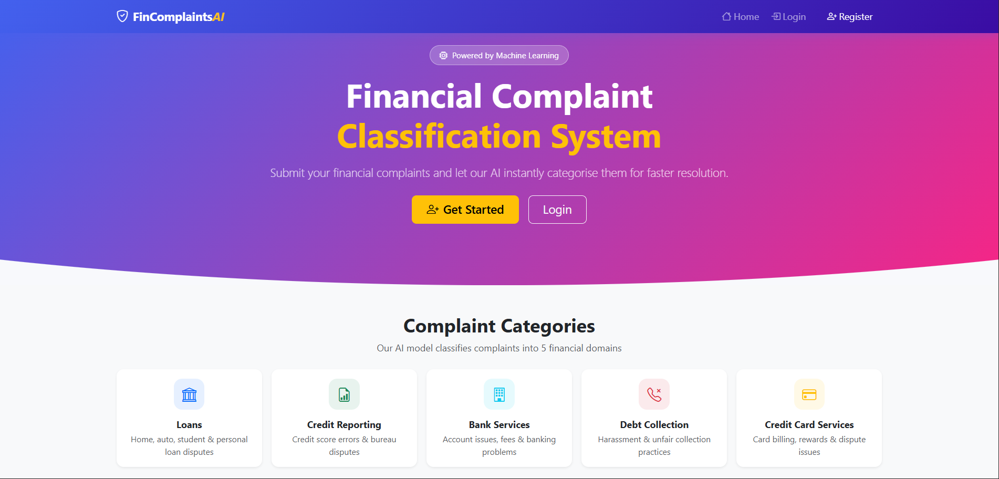
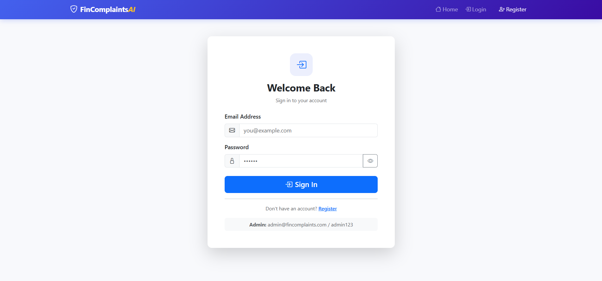
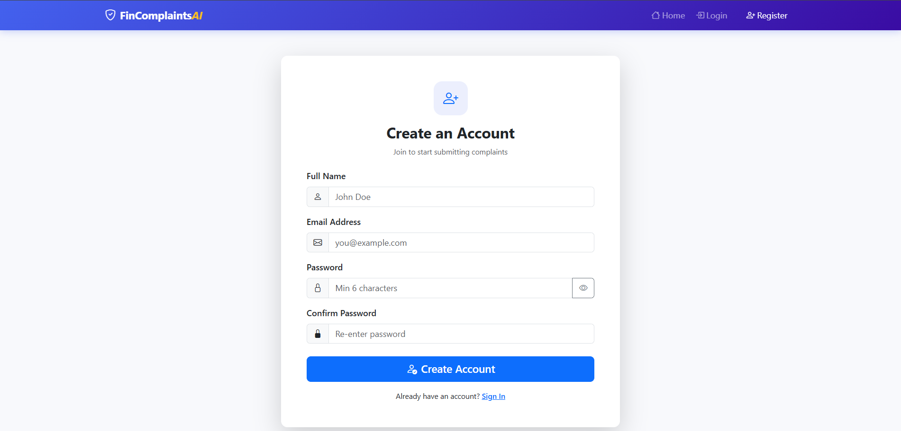
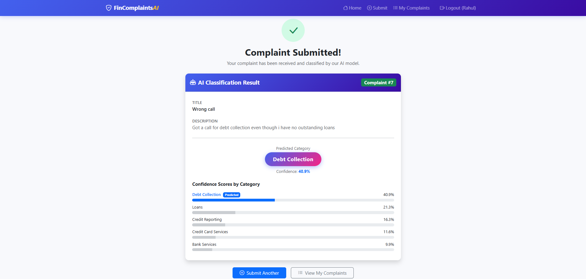
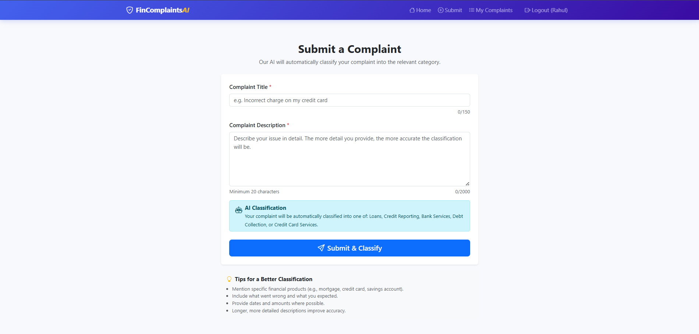
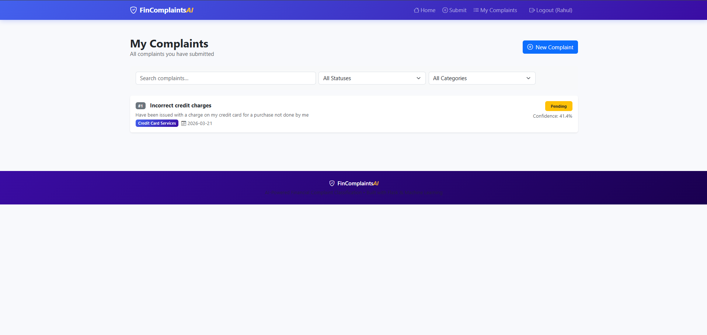
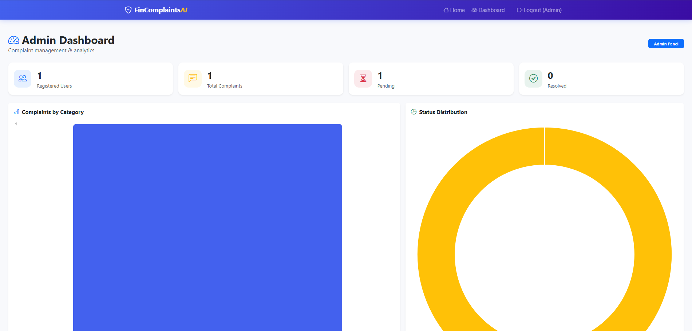

# 🛡️ FinComplaints AI
### AI-Based Financial Complaint Classification Web Application

> A full-stack web application built with **Flask** that allows users to submit financial complaints and automatically classifies them into predefined categories using a **Machine Learning model**.

---

## 📋 Table of Contents

- [Project Overview](#project-overview)
- [Features](#features)
- [Tech Stack](#tech-stack)
- [Project Structure](#project-structure)
- [Setup Instructions](#setup-instructions)
- [Usage Guide](#usage-guide)
- [ML Model Details](#ml-model-details)
- [Routes Reference](#routes-reference)
- [Screenshots](#screenshots)
- [Author](#author)

---

## 📌 Project Overview

FinComplaints AI is a complaint management system tailored for the financial domain. Users can register, log in, and submit detailed financial complaints. The system uses a trained **TF-IDF + Logistic Regression** pipeline to instantly classify each complaint into one of five financial categories:

| Category | Description |
|---|---|
| 🏦 Loans | Home, auto, student & personal loan disputes |
| 📊 Credit Reporting | Credit score errors & bureau disputes |
| 🏢 Bank Services | Account issues, fees & banking problems |
| 📞 Debt Collection | Harassment & unfair collection practices |
| 💳 Credit Card Services | Card billing, rewards & dispute issues |

An **Admin Dashboard** provides analytics, complaint management, and status tracking with interactive charts.

---

## ✨ Features

### 👤 User Module
- User registration with password strength validation
- Secure login / logout with session management
- Complaint submission form with real-time character counter
- AI-powered automatic complaint classification
- Confidence score display with animated progress bars
- Personal complaint history with search & filter

### 🔐 Admin Module
- Secure admin login (separate credentials)
- Dashboard with KPI cards (total users, complaints, pending, resolved)
- Interactive **Bar Chart** — complaints per category
- Interactive **Donut Chart** — status distribution
- Full complaints table with live search and status filter
- One-click status update (Pending → Resolved)

### 🤖 Machine Learning
- TF-IDF vectorizer with bigrams for feature extraction
- Logistic Regression classifier
- Real-time prediction on complaint submission
- Confidence scores across all categories

---

## 🛠️ Tech Stack

| Layer | Technology |
|---|---|
| **Frontend** | HTML5, Bootstrap 5, Bootstrap Icons |
| **Scripting** | JavaScript, jQuery 3.7 |
| **Charts** | Chart.js 4.4 |
| **Backend** | Python 3, Flask 3.0 |
| **Templating** | Jinja2 |
| **Database** | SQLite (via Python `sqlite3`) |
| **ML Library** | scikit-learn, NumPy |
| **Model** | TF-IDF + Logistic Regression |

---

## 📁 Project Structure

```
project/
├── app.py                  # Flask main application file
├── requirements.txt        # Python dependencies
├── complaints.db           # SQLite database (auto-created)
│
├── model/
│   ├── train_model.py      # Script to train & save the ML model
│   ├── predict.py          # Inference module used by Flask
│   └── model.pkl           # Trained model (auto-generated)
│
├── templates/
│   ├── base.html           # Base layout with navbar & footer
│   ├── index.html          # Landing / home page
│   ├── login.html          # User login page
│   ├── register.html       # User registration page
│   ├── submit.html         # Complaint submission form
│   ├── success.html        # Classification result page
│   ├── my_complaints.html  # User complaint history
│   └── dashboard.html      # Admin analytics dashboard
│
└── static/
    ├── css/
    │   └── style.css       # Custom styles (Bootstrap overrides)
    └── js/
        └── script.js       # jQuery validations & UI interactions
```

---

## ⚙️ Setup Instructions

### Prerequisites
- Python 3.9 or higher
- pip (Python package manager)
- Git

### Step 1 — Clone the Repository
```bash
git clone https://github.com/yourusername/fincomplaints-ai.git
cd fincomplaints-ai
```

### Step 2 — Create a Virtual Environment (Recommended)
```bash
# Windows
python -m venv venv
venv\Scripts\activate

# macOS / Linux
python3 -m venv venv
source venv/bin/activate
```

### Step 3 — Install Dependencies
```bash
pip install -r requirements.txt
```

### Step 4 — Train the ML Model
> ⚠️ Run this **once** before starting the app. It generates `model/model.pkl`.
```bash
python model/train_model.py
```

### Step 5 — Run the Application
```bash
python app.py
```

### Step 6 — Open in Browser
```
http://localhost:5000
```

---

## 🚀 Usage Guide

### For Users
1. Visit `http://localhost:5000` and click **Get Started**
2. **Register** with your name, email, and password
3. **Log in** with your credentials
4. Click **Submit a Complaint** and fill in the form
5. The AI will instantly **classify** your complaint
6. View your **complaint history** anytime under *My Complaints*

### For Admin
1. Log in with admin credentials:
   - **Email:** `admin@fincomplaints.com`
   - **Password:** `admin123`
2. You will be redirected to the **Admin Dashboard**
3. View charts, search complaints, and update their status

---

## 🧠 ML Model Details

| Property | Value |
|---|---|
| Algorithm | Logistic Regression |
| Features | TF-IDF (unigrams + bigrams) |
| Max Features | 10,000 |
| Training Samples | 75 (15 per category) |
| Test Accuracy | ~73% |
| Model File | `model/model.pkl` |

### Classification Categories
- Loans
- Credit Reporting
- Bank Services
- Debt Collection
- Credit Card Services

> **Tip:** Longer, more detailed complaint descriptions improve classification accuracy.

---

## 🔗 Routes Reference

| Route | Method | Description | Access |
|---|---|---|---|
| `/` | GET | Landing / home page | Public |
| `/register` | GET, POST | User registration | Public |
| `/login` | GET, POST | User login | Public |
| `/logout` | GET | Logout & clear session | Logged in |
| `/submit` | GET, POST | Submit a complaint | User |
| `/success` | GET | Classification result | User |
| `/my-complaints` | GET | View personal complaints | User |
| `/dashboard` | GET | Admin analytics dashboard | Admin |
| `/update-status` | POST | Update complaint status | Admin |

---

## 📸 Screenshots

### 🏠 Home Page

*Landing page with hero section, complaint categories, and how-it-works steps.*

---

### 🔐 Login Page

*Clean login form with password visibility toggle and admin credentials hint.*

---

### 📝 Register Page

*Registration form with real-time password strength indicator and validation.*

---

### 📤 Submit Complaint

*Complaint submission form with character counter, AI classification notice, and tips.*

---

### ✅ Classification Result

*AI result page showing predicted category, confidence score, and animated progress bars.*

---

### 📋 My Complaints

*User complaint history with search, status filter, and category filter.*

---

### 🛡️ Admin Dashboard

*Admin panel with KPI cards, complaints-by-category bar chart, and status distribution donut chart.*

---

## 🔒 Security Notes

- Passwords are hashed using **SHA-256** before storage
- Admin access is protected by role-based session checks
- All routes use `@login_required` or `@admin_required` decorators
- For production, replace `app.secret_key` with a secure environment variable

---

## 📦 Dependencies

```
flask==3.0.0
scikit-learn==1.4.0
numpy==1.26.4
pandas==2.2.0
```

Install all with:
```bash
pip install -r requirements.txt
```

---

## 👤 Author

**Your Name**
- GitHub: [@yourusername](https://github.com/yourusername)
- Email: youremail@example.com

---

## 📄 License

This project was developed as part of an academic assignment. Free to use for educational purposes.

---

> Built with ❤️ using Flask, scikit-learn, Bootstrap 5, and jQuery